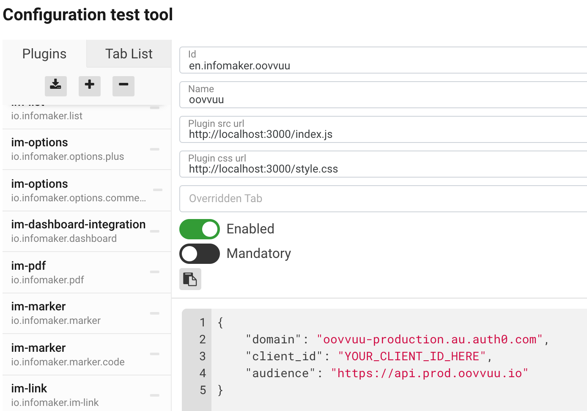

# Oovvuu Naviga Plugin

[Naviga](https://docs.navigaglobal.com/writer/) plugin that allows editors to add an Oovvuu embed to a post.

## Local Development

Test site: https://writer.dev.developer.infomaker.io/

_Credentials to login to the test site are in 1Password._

Naviga is a backend only CMS that acts very similar to Gutenberg. Content is created in Naviga and then sent out to presentation sites for display via an RSS feed. For the purpose of this plugin we are only worried about the Naviga backend, not the RSS feed.

The test site is an environment that is hosted by Naviga where we can perform local development on the plugin without affecting live sites. This is not a typical workflow since we are running code from our localhost directly on the Naviga test site instead of on a local environment.

Follow [this guide](https://docs.navigaglobal.com/writer/developer-guide/index/quickstart#4-add-the-plugin-to-the-local-configuration) to install the plugin on the test site. Below are the details for the plugin:

- id: `en.infomaker.oovvuu`
- name: `oovvuu`

### Setup Auth0 Config
The Naviga Writer does not provide any persistent storage, therefore this plugin only has access to client-side storage. Oovvuu uses Auth0 to perform user authentication and an Auth0 app needs to be created by the Oovvuu team to connect with the Oovvuu API. Once this app is setup you can add those credentials to the plugin configuration in Naviga.

```json
{
    "domain": "oovvuu-production.au.auth0.com",
    "client_id": "YOUR_CLIENT_ID_HERE",
    "audience": "https://api.prod.oovvuu.io"
}
```



### Builds

1. Install node modules `npm ci`
1. Start server `npm start`

After the server is started both the `index.js` and `style.css` files can be found at:
- `http://localhost:3000/index.js`
- `http://localhost:3000/style.css`
